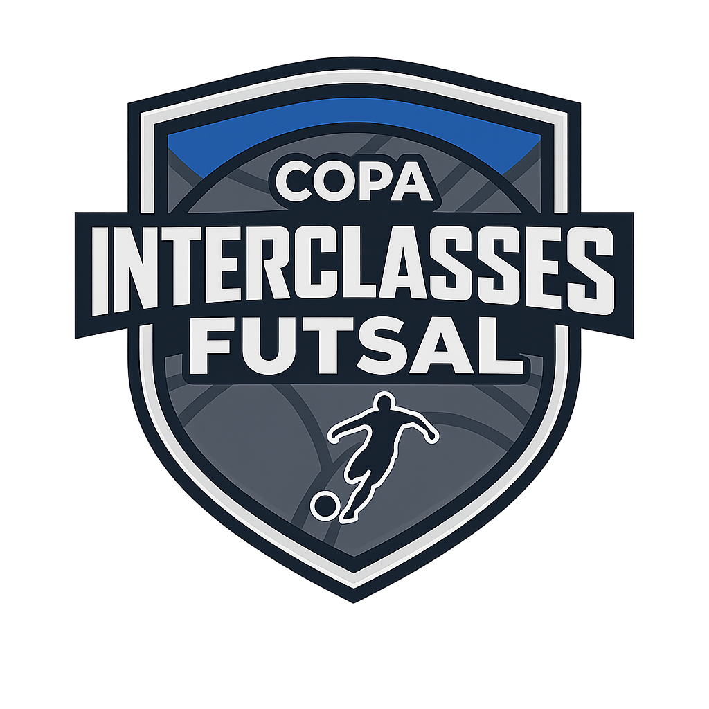

<div align="center">



# CIF Helyos

**Copa Interclasses de Futsal — Colégio Helyos**

Sistema completo de gerenciamento e transmissão ao vivo do campeonato interno de futsal do Colégio Helyos, em Feira de Santana — BA.

[](https://nextjs.org)
[](https://www.typescriptlang.org)
[](https://mongoosejs.com)
[](https://tailwindcss.com)
[](LICENSE)

</div>

---

## Sobre o projeto

O **CIF Helyos** é uma plataforma web desenvolvida para gerenciar e acompanhar em tempo real a Copa Interclasses de Futsal do Colégio Helyos. Oferece tanto um painel público para os estudantes acompanharem o torneio, quanto um painel administrativo completo para a organização gerenciar partidas, jogadores e suspensões.

O sistema suporta duas fases do torneio:
- **Fase de grupos** — com rodadas, classificação dinâmica e acúmulo de cartões
- **Fase eliminatória** — com chave gerada automaticamente, quartas, semis e final

---

## Funcionalidades

### Área Pública
- Classificação ao vivo da fase de grupos
- Calendário e resultados de partidas
- Acompanhamento de partidas em tempo real (atualização automática)
- Perfil de times e jogadores
- Tabela de artilharia com gols, assistências e cartões
- Chave eliminatória interativa
- Galeria de fotos e vídeos
- Compartilhamento de partidas via QR Code e redes sociais

### Painel Administrativo
- Controle ao vivo de partidas (placar, eventos, timer)
- Cadastro e edição de times e jogadores
- Gerenciamento de suspensões automáticas e disciplinares
- Geração automática da chave eliminatória
- Upload de mídias por partida
- Controle de usuários e permissões

### Sistema de Suspensões
- 3 cartões amarelos → suspensão automática de 1 jogo
- Cartão vermelho → suspensão imediata de 1 jogo
- Suspensões disciplinares manuais com duração customizável
- Amarelos zerados na transição para a fase eliminatória
- Suspensões pendentes carregadas entre as fases

---

## Stack tecnológica

| Camada | Tecnologia |
|--------|-----------|
| Framework | Next.js 15 (App Router) |
| Linguagem | TypeScript 5 |
| Estilização | Tailwind CSS 4 |
| Banco de dados | MongoDB + Mongoose 9 |
| Autenticação | NextAuth 5 (Credentials) |
| Data fetching | SWR 2 |
| Ícones | Lucide React |
| QR Code | qrcode.react |
| Segurança | bcryptjs (hash de senhas) |

---

## Pré-requisitos

- [Node.js](https://nodejs.org) 18+
- [MongoDB](https://www.mongodb.com) rodando localmente ou via Atlas

---

## Instalação

```bash
# Clone o repositório
git clone https://github.com/felipebborges2/cif-helyos.git
cd cif-helyos

# Instale as dependências
npm install
```

### Variáveis de ambiente

Crie um arquivo `.env.local` na raiz do projeto:

```env
MONGODB_URI=mongodb://localhost:27017/cif-helyos
NEXTAUTH_URL=http://localhost:3000
NEXTAUTH_SECRET=sua-chave-secreta-aqui
INVITE_CODE=seu-codigo-de-convite
```

> **Atenção:** Troque `NEXTAUTH_SECRET` por uma string longa e aleatória em produção.

### Criando o usuário admin

```bash
node scripts/setup-admin.mjs
```

Isso cria o primeiro usuário administrador no banco de dados.

### Rodando em desenvolvimento

```bash
npm run dev
```

Acesse [http://localhost:3000](http://localhost:3000).

---

## Scripts disponíveis

```bash
npm run dev       # Servidor de desenvolvimento com hot reload
npm run build     # Build para produção
npm start         # Inicia o servidor de produção
npm run lint      # Verifica o código com ESLint
```

---

## Estrutura do projeto

```
cif-helyos/
├── app/
│   ├── admin/              # Painel administrativo (protegido)
│   ├── api/                # Rotas de API (REST)
│   ├── bracket/            # Chave eliminatória
│   ├── estatisticas/       # Artilharia e estatísticas
│   ├── jogadores/          # Lista e perfil de jogadores
│   ├── jogos/              # Calendário de partidas
│   ├── midias/             # Galeria de fotos e vídeos
│   ├── partida/[id]/       # Partida ao vivo
│   └── times/              # Times e perfis
├── components/             # Componentes reutilizáveis
├── lib/                    # Helpers (auth, db, suspensões)
├── models/                 # Schemas Mongoose
├── public/logos/           # Logos dos times
├── scripts/                # Scripts utilitários
└── types/                  # Tipos TypeScript globais
```

---

## API — principais endpoints

| Método | Endpoint | Descrição |
|--------|----------|-----------|
| `GET` | `/api/teams` | Lista todos os times |
| `GET` | `/api/players` | Lista jogadores (filtro por time) |
| `GET` | `/api/matches` | Lista partidas (filtro por fase/status) |
| `GET` | `/api/standings` | Classificação da fase de grupos |
| `GET` | `/api/artilharia` | Artilheiros com gols e assistências |
| `GET` | `/api/suspensions` | Lista suspensões ativas |
| `POST` | `/api/bracket/generate` | Gera chave eliminatória |
| `POST` | `/api/transition` | Avança para fase eliminatória |
| `POST` | `/api/matches/[id]/events` | Adiciona evento na partida ao vivo |

Rotas de escrita são protegidas por sessão autenticada.

---

## Contribuindo

1. Faça um fork do projeto
2. Crie sua branch: `git checkout -b feature/minha-feature`
3. Commit suas mudanças: `git commit -m 'Add minha feature'`
4. Push para a branch: `git push origin feature/minha-feature`
5. Abra um Pull Request

---

## Licença

Distribuído sob a licença MIT. Veja [LICENSE](LICENSE) para mais informações.

---

<div align="center">

Porto Alegre, RS · Feira de Santana, BA

</div>
